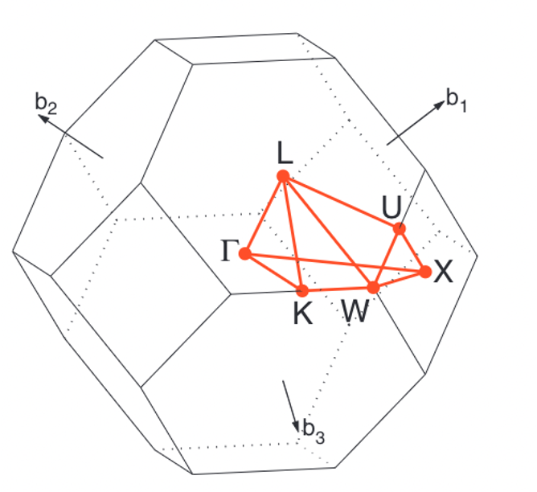

Calculation of band structure with QuantumEspresso (QE)
========================================================

This example can be found [HERE](https://github.com/masato1122/Examples_QE/tree/main/examples/band_structure).

You can learn how to calculate electronic states such as band structure and density of states (DOS) 
with QuantumEspresso (QE) following the process described below.
Final results can be found in ``./results``.
While the following process can be run with shell scripts in ``./shell``, 
please follow step by step if it's the first try.


Check a few things before starting the analysis 
------------------------------------------------

### 0. Make sure you're in this example directory in your terminal

```
$ pwd
(location depending on your environment)/Examples_QE/examples/band_structure
```

### 1. Check a pseudopotential functional file used in this example

```
$ ls ../pseudo
README.md    Si.pbesol-n-rrkjus_psl.1.0.0.UPF
```

A UPF (unified pseudopotential functional) file used in this example can be found in ``../pseudo`` directory.

> When you calculate other materials, you need to download UPF files of other elements from [the official website](https://www.materialscloud.org/discover/sssp/table/efficiency).

### 2. Take a look at python scripts

> **NOTE:** While python scripts may be useful to generate input scripts for QE, if you have troubles to use them, you can use files in ``./scripts`` without using the python scripts.

Python scripts generating input scripts for QE are prepared in ``../tools``.

```
$ ls ../tools
inout         mk_pwinput.py mpl           plot_band.py  plot_dos.py   plot_pdos.py
```

``mk_pwinput.py`` is used to make input scripts of QE and
``plot_{band/dos/pdos}.py`` is used to plot corresponding results.
(You don't need to care files in ``inout`` and ``mpl`` so much. They are called from 
``mk_pwinput.py`` or ``plot_***.py``.)
The options of ``mk_pwinput.py`` can be checked with "-h" option.

```
$ python ../tools/mk_pwinput.py -h
Usage: mk_pwinput.py [options]

Options:
  -h, --help            show this help message and exit
  -f FILENAME, --filename=FILENAME
                        structure file name [../Si.cif]
  --reciprocal_density=RECIPROCAL_DENSITY
                        kmesh density in the reciprocal space [20]
  --property=PROPERTY   property analyzed (scf, dos, bands, ...) [scf]
  --pseudo_dir=PSEUDO_DIR
                        directory of peudofunctions [../pseudo]
  --outdir=OUTDIR       output directory [./out]
  --ecutwfc=ECUTWFC     kinetic energy cutoff for wavefunctionswith the unit
                        of Ry [60.0]
  --frac_ecutrho=FRAC_ECUTRHO
                        kinetic energy cutoff for charge density and potential
                        [4.0]
  --conv_thr=CONV_THR   convergence threshold for selfconsistency [1e-6]
```

For example, a structure file can be given with "-f" or "--filename" option.

```
$ python ../tools/mk_pwinput.py -f ../Si.cif
```

> If you want to know details of input parameters of pw.x of QE, see [HERE](https://www.quantum-espresso.org/Doc/INPUT_PW.html).


Calcualtion process
--------------------

### 1. Self-consistent field (SCF) calculation

First of all, the charge distribution in the crystal structure is calculated with SCF method. 
The input script for the SCF calculation (``scf.in``) can be generated as below.

```
python ../tools/mk_pwinput.py \
    --filename ../Si.cif \
    --pseudo_dir ../pseudo \
    --outdir ./out \
    --property scf \
    --reciprocal_density 20 
```
Make sure that ``scf.in`` and ``pp.in`` were generated.
If you have an error, you can use a file in ``./scripts``: 

```
$ cp ./scripts/scf.in ./
```

Make sure that ``scf.in`` is generated properly:

> **MEMO:** In ``less`` command, to go forward/backward, type ``f``/``b``, and to escape from ``less`` command, type ``q``.

```
$ less scf.in
&CONTROL
  calculation = 'scf',
  outdir = './out',
  prefix = 'Si',
  pseudo_dir = '../pseudo',
  restart_mode = 'from_scratch',
/
&SYSTEM
  ecutwfc = 60.0,
  occupations = 'fixed',
  ibrav = 0,
  nat = 2,
  ntyp = 1,
/
&ELECTRONS
  conv_thr = 1d-06,
/
&IONS
/
&CELL
/
ATOMIC_SPECIES
  Si  28.0855 Si.pbesol-n-rrkjus_psl.1.0.0.UPF
ATOMIC_POSITIONS crystal
  Si 0.250000 0.250000 0.250000
  Si 0.500000 0.500000 0.500000
K_POINTS automatic
  4 4 4 0 0 0
CELL_PARAMETERS angstrom
  -2.734364 -2.734364 0.000000
  -2.734364 0.000000 -2.734364
  0.000000 -2.734364 -2.734364
```

The SCF calculation can be conducted with ``pw.x`` (``pw.exe`` for Windows).

a) To print the result in the terminal and output in a file (``scf.out``) at the same time:
```
$ pw.x < scf.in | tee scf.out
```

b) To output in a file only:
```
$ pw.x < scf.in > scf.out
```

> **MEMO:** If you don't set a path for QE commands, use the absolute path instead of ``pw.x``. 


Make sure that ``./out`` directory was generated after the calculation.

```
$ ls ./out
Si.save Si.xml

$ ls ./out/Si.save/
Si.pbesol-n-rrkjus_psl.1.0.0.UPF wfc2.dat                         wfc6.dat
charge-density.dat               wfc3.dat                         wfc7.dat
data-file-schema.xml             wfc4.dat                         wfc8.dat
wfc1.dat                         wfc5.dat
```

Wavefunctions (wfc\*.dat) obtained with the SCF calculation were saved in ``./out/Si.save``.

### 2. Charge density

Calcualte charge density with wavefunctions obtained with the SCF calculation.

```
pp.x < pp.in | tee pp.out
```
Make sure that ``Si_rho.cube`` was generated.

To visualize the charge density, you need a visualizer such as [VESTA](https://jp-minerals.org/vesta/en/).
``Si_rho.cube`` can be visualized with VESTA.


### 3. DOS with non self-consistent field (NSCF) calculation

Once wavefunctions, namely charge density, are obtained,
electronic states such as density of states (DOS) and band structure
can be calculated with the obtained wavefunctions.

Make input scripts for DOS calculation:

```
python ../tools/mk_pwinput.py \
    --filename ../Si.cif \
    --pseudo_dir ../pseudo \
    --outdir ./out \
    --property dos \
    --reciprocal_density 40
```

> **_NOTE:_** 
The k-mesh density, defined by "--reciprocal_density" option, for DOS (40)
is larger than that for the SCF calculation (20). 
In general, the SCF calculation is conducted with a coarser k-mesh 
because the SCF takes longer time.

Make sure that ``nscf_dos.in``, ``dos.in``, and ``pdos.in`` were generated with the above command.

```
$ ls
README.md  dos.in  nscf_dos.in  out  pdos.in  scf.in  scf.out
```

Run a NSCF calculation for DOS:

```
$ pw.x < nscf_dos.in | tee nscf_dos.out
```

You can find more wfc\*.dat files in ``./out/Si.save``.

```
$ ls ./out/Si.save
```

Calculte DOS with ``dos.x``:

```
$ dos.x < dos.in | tee dos.out
```

Partical DOS (PDOS), which represent DOS on each site (atom), can also be calculated with ``projwfc.x``:

```
$ projwfc.x < pdos.in | tee pdos.out
```

PDOS is saved in ``Si.pdos_atm***_wfc***`` files.

Plot DOS (``Si.dos``) and PDOS (``Si.pdos_atm***_wfc***``). 
If python is available, figures can be generated with commands below.
If not, you can plot with any software such as Excel.

```
python ../tools/plot_dos.py -f Si.dos
python ../tools/plot_pdos.py
```

### 4. Band structure

Prepare input scripts for band calculation:

```
python ../tools/mk_pwinput.py \
    --filename ../Si.cif \
    --pseudo_dir ../pseudo \
    --outdir ./out \
    --property bands
```

To plot a band structure, symmetric k-points are selected as shown in the figure below.

<figure><figcaption>Brillouin zone of FCC lattice. [W. Setyawan and S. Curtarolo, Comp. Mater. Sci. 49 299 (2010).]</figcaption></figure>

Make sure that ``nscf_bands.in``, ``bands.in``, and ``plotband.in`` are generated:

Calculate the band structure:

```
$ bands.x < bands.in | tee bands.out
```

Plot the band structure calculated (``Si.band.gnu``) with python scripts, Excel, or any other methods:

```
$ plotband.x < plotband.in
```

or

```
python ../tools/plot_band.py --filename Si.band.gnu --nelectrons 8
```

### 5. Quiz

#### 1. Run a calculation with MPI.

> If you don't have ``mpirun`` command, you can skip this part.

```
$ mpirun -n 2 pw.x < scf.in | tee scf.out
```
Then, check the number of processors used for the calculation written in ``scf.out``.

#### 2. Calculate the total energy with different cutoff energies.

Modify ``ecutwfc`` and ``ecutrho`` in ``scf.in`` and run the SCF calculation.

#### 3. Calculate the total energy with different k-mesh densities.

Modify ``K_POINTS`` in scf.in file and run the SCF calculation.

#### 4. Check the number of states below the Fermi level in DOS (see integrated DOS in Si.dos).

You can find that the number of states below the Fermi level in integrated DOS is eight, 
which is the same as the number of electrons in the primitive cell.

The number of electrons in a real system is $N_{el}^{tot} = N_{el}^{prim} N_{cell}$, 
where $N_{el}^{prim}$ is the number of electrons in the primitive cell, and
$N_{cell}$ is the number of primitive cells in the system, 
which is equal to the number of k-points, $N_{k}$.
These $N_{el}^{prim} N_{cell}$ electrons are at the valence bands (below Fermi energy) in the ground state.

#### 5. Count the number of states in the band structure below the Fermi level.

You can find that the number of states below the Fermi level is same as 
$N_{el}^{prim} N_{k} / 2$, where $N_{k}$ is the number of kpoints calculated and
the factor 2 denotes the number of spins. Note that the spin is not considred in this calculation.

#### 6. Estimate the band gap and compare with experimental values

A simple way may be estimate from ``Si.dos`` file. 
The valence band maximum (VBM) and conduction band minimum (CBM) can be obtained from ``Si.dos`` 
around the energy range near the Fermi level where the integrated DOS does not change.

Another more precise way is to read eigenvalues (energies) from ``nscf_dos.out``.
You can find an output shown below in ``nscf_dos.out`` 
which shows calculated k-points and energies at these k-points.
From these energies, VBM and CBM can be estimated.

```
    ...
     End of band structure calculation

          k = 0.0000 0.0000 0.0000 (  2109 PWs)   bands (ev):

    -5.8725   5.9836   5.9836   5.9836   8.4765   8.4765   8.4765   9.0585

          k = 0.1179-0.1179-0.1179 (  2151 PWs)   bands (ev):

    -5.5163   3.5936   5.5346   5.5346   8.1930   9.1185   9.1185  11.2014
    ...
```

#### 7. Calculate other materials if you're interested.

To analyze other materials, you need to prepare pseudopotential function files and
the structure file for the material. Then, modify input scripts.


