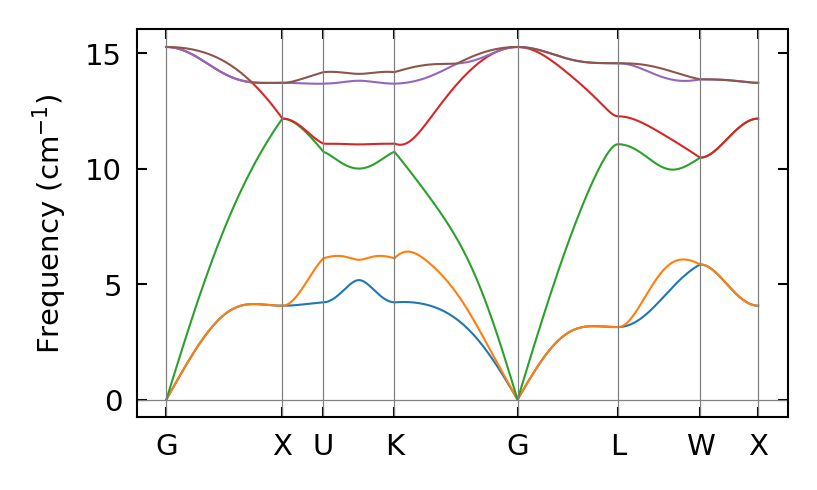

Calculation of Phonon Dispersion with Finite-displacement method
=================================================================

## 1. Prepare supercells with displacements

Suprecells with small displacements are created with Phonopy.

```
$ phonopy --qe -d --dim="2 2 2" -c ../scripts/Si.in
```

2x2x2 supercells with displacements are created from `../scripts/Si.in` 
which contains info of a conventional unit cell of Si.

```
$ ls
phonopy_disp.yaml  supercell-001.in  supercell.in
```

* ``supercell.in``: pristine supercell structure
* ``supercell-***.in``: supercells in which an atom is slightly displaced
* ``phonpy_disp.yaml``: info of the displacements

## 2. Prepare input scripts for QE

```
header=../scripts/header.in
cat ${header} supercell.in > pristine.in
for i in 001; do
    cat ${header} supercell-${i}.in > Si-${i}.in
done
```

``Si-001.in`` were generated.

Note that following parameters are set in ``header``.

```
tprnfor = .true.
nat = 64
```

``tprnfor`` is set to be ``.true.`` to calculate atomic forces and 
``nat`` is the number of atoms in a supercell.


## 3. Calculate atomic forces in supercells with displacements

```
for label in 001; do
    pw.x < Si-${label}.in | tee Si-${label}.out
done
```

Make sure following files are generated.

```
$ ls *.out
... Si-001.out
```

## 4. Extract atomic forces from output files

The following command creates ``FORCE_SETS``, set of atomic forces in supercells.

```
$ phonopy -f Si-001.out
```

## 5. Calculate phonon dispersion

Calcualte phonon dispersion with 
the set of displacements (``phonopy_disp.yaml``) and forces (``FORCE_SETS``).

```
$ phonopy --qe -c ../scripts/Si.in -p ../scripts/band.conf --writefc
```

> **OUTPUT** : 

## 6. Plot phonon dispersion

```
$ python ../tools/plot_phband_phonopy.py -f band.yaml
```



